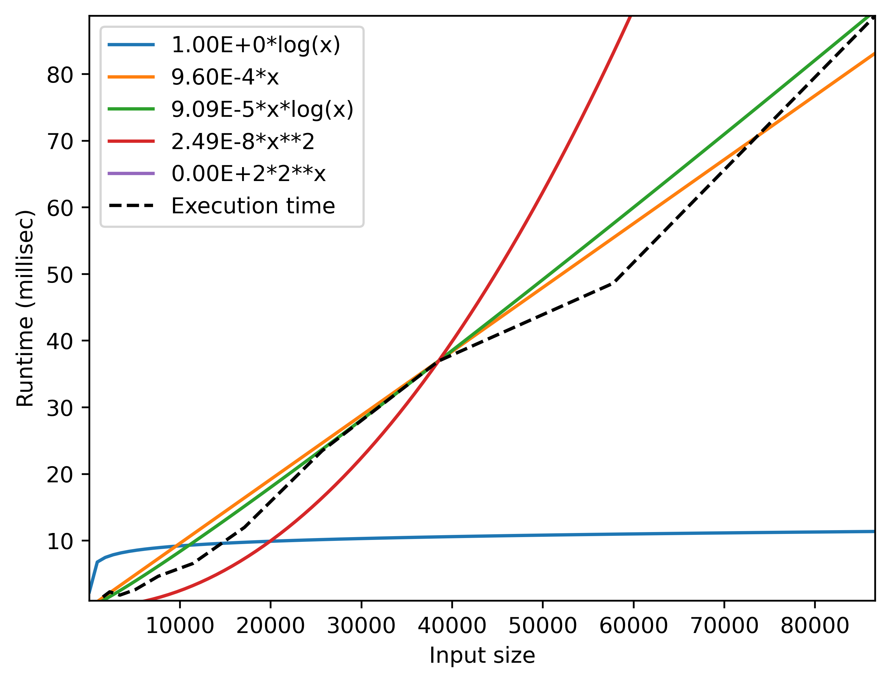
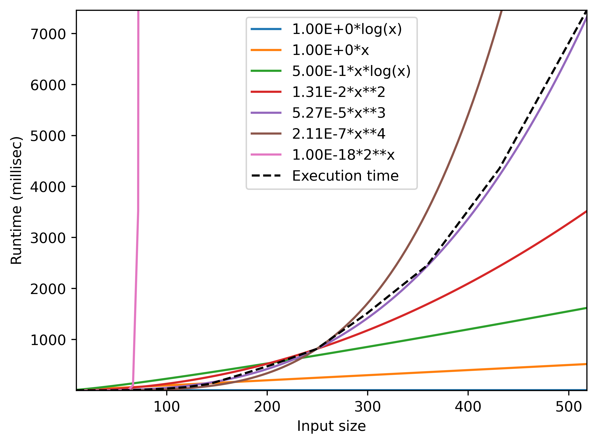

# TP1 INFO003

## Lancement

`python graphChronoGenerator.py Probleme<NumeroDuProbleme>/testDataP<NumeroDuProbleme>q<NumeroDeLaQuestion>.json`

## Problème 1

### a) Voir le fichier `Probleme1/probleme1On.py` -> `def progOn()`

### b) Voir le fichier `Probleme1/probleme1On2.py` -> `def progOn2()`

### c) Voir le fichier `Probleme1/probleme1On3.py` -> `def progOn3()`

### d) Voir le fichier `Probleme1/probleme1Onlogn.py` -> `def progOnlogn()`

### e) Voir le fichier `Probleme1/probleme1Oexp.py` -> `def progOexp()`

## Problème 2
### a) Voir le fichier `Probleme2/probleme2Naif.py` -> `def distance_min_naive()`
### b)
L'algorithme naïf a une complexité de O(n^2) car il y a deux boucles imbriquées. La première boucle parcourt la liste des points et la deuxième boucle parcourt la liste des points à partir du point courant. La complexité est donc de O(n*(n-1)/2) = O(n^2).
On peut voir que la complexité de l'algorithme naïf est quadratique via l'exécution du fichier testDataP2qb.json.

### c) Voir le fichier `Probleme2/probleme2DpR.py` -> `def distance_min_diviser_pour_regner()`
### d)
Cet algorithme a une complexité attendue de T(n) = 2T(n/2) + O(n log n). D'après le théorème maître, on a donc T(n) = O(n log n).
On peut vérifier que la complexité de l'algorithme diviser pour régner est quasi-linéaire via l'exécution du fichier testDataP2qd.json.

On peut voir que d'après le graph on tourne plus autour d'une complexité autour de O(n^1.5) que vers O(n log n)
### e)
Si on est sur une entrée de 10^8, le premier programme devrait tourner en environ 10^8^2 opérations, soit 10^16 opérations. Le deuxième programme devrait tourner en environ 10^8 log(10^8) opérations, soit 10^8 * 8 opérations, soit 8 * 10^8 opérations.
Le deuxième programme lui devrait tourner en environ 10^8^1.5 opérations, soit 10^12 opérations environ.

## Problème 3

### a) Voir le fichier `Probleme3/probleme3qa.py` -> `def sommeMin()`

### b)
La taille de l'entrée correspond à la taille du plateau.
Sa complexité temporelle va être exponentielle en fonction de l'entrée, donc non polynomiale.
T(n) ~= 3T(n-5) + O(1)
D'après le théorème, c>1, donc on a T(n) = O(k^n), où k>1 est à déterminer.

### c)

### d)
L'algorithme est si long à cause de calculs similaires répétés (par exemple le calcul sur n-5 est fait 3 fois).

### e) Voir le fichier `Probleme3/probleme3qe.py` -> `def sommeMin()`

### f)
Sa complexité va tourner autour de O(n) (1 boucle qui effectue uniquement du O(1))

### g)

On tombe bien sur une complexité linéaire.
